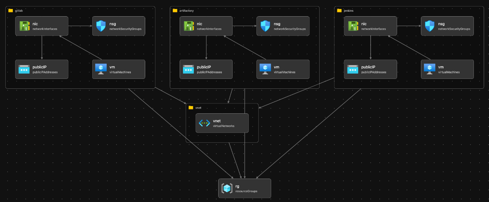

# Simple Bicep project to provision Jenkins, Gitlab and Artifactory

This project provisions a simple vnet with one subnet where all the tools are provisioned.
All the tools are provisiones on Ubuntu VMs with same username and password. To access each product a public IP is provisioned for each of them.



## Deployment 

```
az deployment sub create --name deployment001 --location australiaeast --template-file main.bicep --parameters rgName=rg-devops-nonprod rgLocation=australiaeast adminUsername=<your_admin_username> adminPasswordOrKey=<your_password>
```